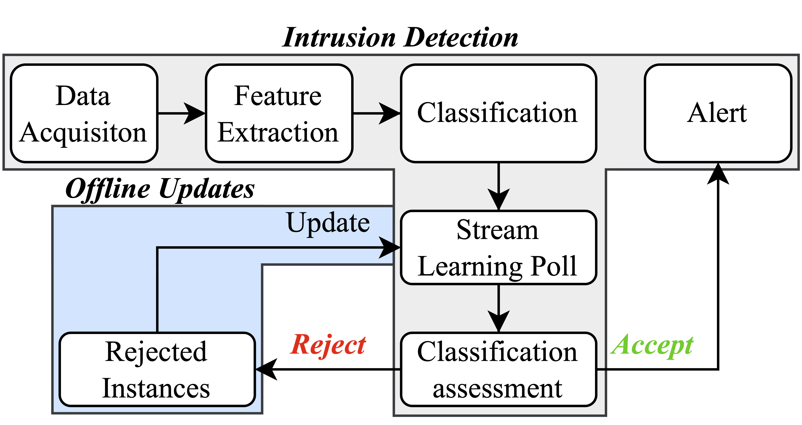

# A Reliable Stream Learning Model for Network Intrusion Detection Systems

## Authors
- Pedro Horchulhack
- Eduardo Kugler Viegas
- Altair Olivo Santin

## Abstract
<p style="text-align: justify;">
    Developing a reliable Network Intrusion Detection System (NIDS) remains a complex task due to the non-stationary nature of network traffic and the need for frequent updates to maintain high classification performance. 
Many existing approaches assume a stationary network environment, which overlooks the challenges associated with periodic model updates, such as the need for large amounts of properly labeled data and significant computational resources. 
This issue is particularly challenging for real-time applications, where minimizing delays and ensuring accuracy is crucial. This paper proposes an analysis of how changes in the network behavior negatively affects the long-term of ML-Based NIDS. 
For such a problem, it is proposed a new NIDS approach integrating stream learning with a reject option technique to simplify the model update process while ensuring consistent classification accuracy over time.
The proposal uses stream learning classifiers to incrementally incorporate new data, while the reject option allows the system to evaluate the reliability of classifications before they are used for updates.
The scheme operates with minimal intervention, with rejected instances stored for future updates and used to fine-tune the model over time, ensuring adaptation to evolving network conditions.
Experimental results demonstrate that the proposed approach maintains high classification accuracy over a year, even without recurrent updates, and achieves significant improvements in true positive rates compared to traditional methods.
The system can operate for up to three months without updates, with no significant degradation in performance.</p>

## Proposal



## Dataset
[MAWILab Dataset](https://secplab.ppgia.pucpr.br/?q=idsovertime)

## Citation
```bibtex
@article{Horchulhack_Viegas_Santin_2026, 
    title={A Reliable Stream Learning Model for Network Intrusion Detection Systems}, 
    volume={32}, 
    url={https://journals-sol.sbc.org.br/index.php/jbcs/article/view/5608}, 
    DOI={10.5753/jbcs.2026.5608}, 
    number={1}, 
    journal={Journal of the Brazilian Computer Society}, 
    author={Horchulhack, Pedro and Viegas, Eduardo Kugler and Santin, Altair Olivo}, 
    year={2026}, 
    month={Mar.}, 
    pages={186–200} 
}
```
